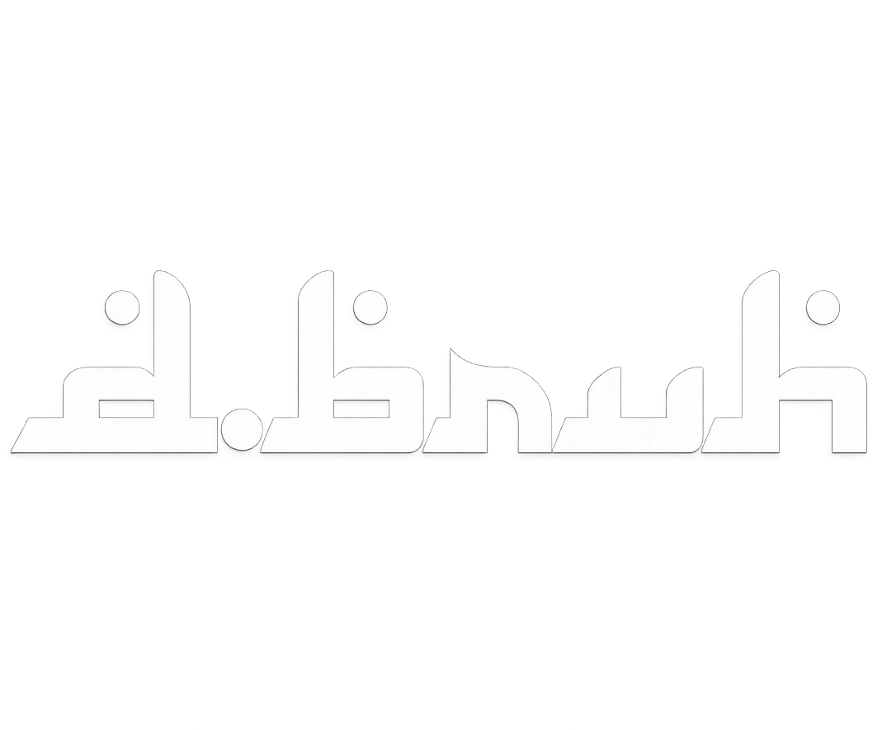

# 🌲 d.bruh — Website Kenang-Kenangan

<p align="center">
  
</p>

<p align="center">
  <em>Bukan cuma galeri foto. Ini rumah buat semua momen yang gak mau kita lupain.</em>
</p>

<p align="center">
  
  
  
</p>

---

## 📖 Tentang

Tiga tahun itu gak lama, tapi juga gak sebentar untuk dilupain begitu saja.

`d.bruh` adalah website kenangan pribadi untuk angkatan — bukan buat publik, cuma buat kita. Tempat semua foto tongkrongan, momen random, dan pesan perpisahan punya rumah yang gak gampang ketimbun waktu kayak story yang ilang 24 jam atau chat yang ketimbun grup lain.

## ✨ Fitur

| Fitur | Deskripsi |
|---|---|
| 🏠 **Beranda** | Hero, filter kategori cepat, dan preview konten |
| 🖼️ **Galeri** | Kumpulan foto kenangan, bisa difilter per kategori |
| 🕰️ **Momen** | Linimasa santai — bukan milestone formal, tapi cerita nongkrong |
| 🎬 **Video** | Rekap video dengan player modal inline |
| 👥 **Profil Teman** | Kartu profil setiap orang di angkatan |
| 💌 **Pesan & Kesan** | Dinding pesan perpisahan dari teman-teman |
| 📝 **Tentang** | Cerita di balik kenapa website ini dibuat |

## 🎨 Palette — *Forest Coffee*

Hangat, alami, dan nyaman. Cocok buat tema adventure, ngopi, dan kebersamaan.

| Warna | Hex | Kegunaan |
|---|---|---|
| 🟢 Forest Green | `#2D5A4A` | Primary — navigasi, tombol utama |
| 🟤 Coffee Brown | `#6F4E37` | Sekunder — kartu, elemen aksen |
| 🟠 Sunset Orange | `#E07A5F` | Aksen penting — highlight, hover |
| ⚪ Cream | `#F4F1EA` | Background utama |
| ⚫ Dark Charcoal | `#2B2B2B` | Teks utama |

**Font:** [Cormorant Garamond](https://fonts.google.com/specimen/Cormorant+Garamond) (heading) + [Plus Jakarta Sans](https://fonts.google.com/specimen/Plus+Jakarta+Sans) (body)

## 🛠️ Tech Stack

**Saat ini (versi statis):**
- HTML5, CSS3 (custom properties, no framework)
- Vanilla JavaScript

**Roadmap (versi dinamis):**
- ⚛️ Next.js 14
- 🎨 Tailwind CSS
- 🗄️ Supabase (auth, database, storage)
- ▲ Vercel (deployment)

## 📂 Struktur Project

```
d-bruh/
├── index.html          # Beranda
├── profil-teman.html   # Profil semua teman
├── pesan-kesan.html    # Dinding pesan & kesan
├── tentang.html         # Cerita di balik website ini
├── style.css            # Semua styling
├── script.js             # Interaktivitas (filter, modal video, dll)
└── assets/
    └── logo.png
```

## 🚀 Cara Menjalankan

1. Clone repo ini
   ```bash
   git clone https://github.com/username/d-bruh.git
   cd d-bruh
   ```
2. Buka `index.html` langsung di browser, **atau** pakai Live Server (disarankan):
   - Buka folder ini di VSCode
   - Install extension **Live Server**
   - Klik kanan `index.html` → **Open with Live Server**

## 🗺️ Roadmap

- [x] Desain visual & struktur halaman
- [x] Navbar dengan dropdown (Konten & Komunitas)
- [x] Halaman Beranda, Galeri, Momen, Video
- [x] Halaman Profil Teman & Pesan Kesan
- [x] Halaman Tentang
- [ ] Setup Supabase (auth + database)
- [ ] Sistem login pakai kode undangan
- [ ] Upload foto/video oleh teman-teman
- [ ] Deploy ke Vercel

## 🤝 Kontribusi

Project ini dikerjain bareng, dengan branch masing-masing lalu digabung ke `main` lewat Pull Request. Kalau kamu bagian dari tim ini dan mau nambahin sesuatu:

```bash
git checkout -b nama-branch-kamu
# ...ngerjain sesuatu...
git add .
git commit -m "deskripsi perubahan"
git push -u origin nama-branch-kamu
```
Lalu buka Pull Request ke `main` di GitHub.

## 💌 Dibuat oleh

**Iyan** & **Arap** — sambil libur, sambil belajar, sambil kangen-kangenan.

<p align="center">✦ ✦ ✦</p>
